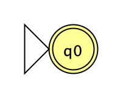
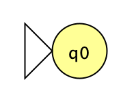
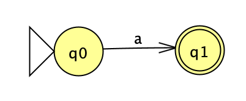
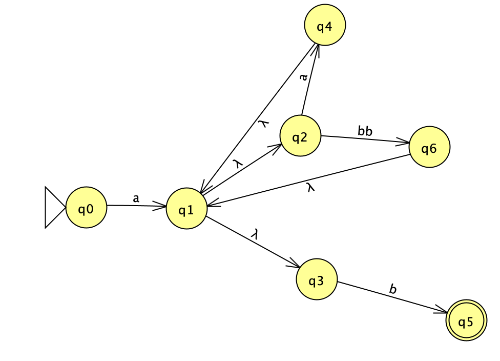
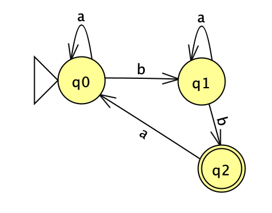
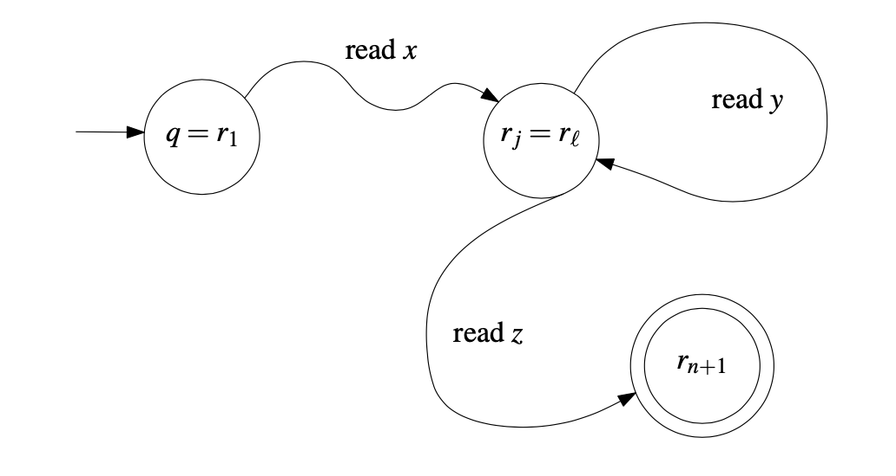

# **Day 1**
**Loom:** There are two options for each flip and four flips. You can't have all up or down, so the number of options is 24 - 2

### Pillars of CS Theory
#### Automata Theory
* Taking mechanical processes and seeing what can be done with them.
* **Domain:** values that are inputs to the function
* **Codomain:** all possible valid outputs of a function
* Types of functions
  * **One-to-one (injective):** no two values of the domain map to the same output (codomain value). ex: x + 1
  * **Onto (surjective):** all of the values in the codomain are mapped to. doesn't matter how many values in the domain map to each codomain value
  * **One-to-one and onto (bijective):** every single input in the domain has one and only one value in the codomain, and each value in the codomain maps to one value in the domain. D and CD are fully covered

#### Computability Theory
**Input:** Type in `7+2<enter>`, maps to ascii numbers (unique int values). Those ints can be represented as binary numbers (bitstream).  
**Output:** output displays on your screen, but those are just a variety of pixel values (location and darkness). The original bitstream is converted to the output bitstream, then converted to ints again, then pixels  
**Binary in, binary out**  
*Example, picture search:* "delicate arch" can be converted to ascii then binary. Basically the same but complex, you get back an output binary but in color  
1. | Fxn | D: CD |
   | ----------- | ----------- |
   | range() | int : list of ints |
   | length() | string : int |
2. *Can you precisely define a fxn that can't be defined in python? does one exist?* There are some things that can be written down mathematically that can't be computable (doesn't seem legit but it is). *Can you, as a human, analyze code and figure out if it will crash?* Nope. You cannot write a program that can analyze another program to tell you if it'll work
3. *Are there non-trivial ops that can be done in one language and not another?* We can do the same kinds of math. computations across languages. The set of fxns they can compute is equal

#### Complexity Theory
Order of alg, O() time  

### Math Background
* **Important math. sets**
  * N: set of natural numbers {1, 2, 3, ...}
  * Z: set of integers {..., -3, -2, -1, 0, 1, 2, 3, ...}
  * Q: set of rational numbers. x/y where x and y are both ints and y is not zero
  * R: set of real numbers
* **Sets:** collection of math. objects that is unordered and does not have repeats
* **Set Operations**  
  **A = {15,18. 4. 99, 101}** &nbsp;&nbsp;&nbsp;&nbsp;&nbsp;&nbsp; **B = {12, 87, 4, 42, 18}**
  * **Membership:** 15 E A
  * **Intersection:** A &cap; B = {18, 4}
  * **Union:** A &cup; B = {15, 18, 4, 99, 101, 12, 87, 42}
  * **Difference:** A - B = {15, 99, 101} (also A \ B)  
    A \ B = {x : x ∈ A and x ̸∈ B}
  * **Subset:** {4, 99} &SubsetEqual; A
  * **Powerset:** set of all possible subsets. the size of a powerset is 2n where n is the length of the og set. there are two options for each element in the set, on or off.  
  Ex: &#119979;({1, 2, 3}) = {{}, {1}, {2}, {3}, {1,2}, {1,3}, {2,3}, {1,2,3}}
  * **Cartesian product:** A × B = {(x, y) : x ∈ A and y ∈ B},
* **Proofs**
  * **Proof by contradiction:**  
    Theorem: if n2 is odd, then n is odd.   
    Assume n2 is odd and n is even.  
    Since n is even, we can write it as n = 2x  
    Then we can rewrite n2 as (2x)2 = (2x)(2x) = 2(2x2).  
    This is 2(some_integer), so n2 must be even, but we assumed it was odd.  This is a contradiction, so our assumption must be false.
  * **Direct proof**
  * **Proof by induction**
  * **Proof by construction**
  * **Proof by exhaustion**
  * **...**
* **Alphabet:** a set of symbols  
  &sum; = {a, b, c}
* **Language:** a set of strings from a given alphabet  
  L = {aa, ab, a, ccb}  
  w = ccb  
  |w| = 3  
  The language in the delicate arch example is the combo of the input:output mapping pair. If one pixel were different it would no longer be in the language.
* **String:** over an alphabet Σ is a finite sequence of symbols, where each symbol is an element of Σ.
___
# **Day 2**
### **Some notes**
* a language can have infinite length
* each string in a language must be finite length
  * there is a finite size alphabet (arbitrarily large)
  * it would never get the end if there were inf. length strings

### Deterministic Finite Automata
* have finite memory
* if a string ends you in an accept state it is a valid string in the language
* if a letter is allowed in the alphabet, there must be an option for each state for that symbol. if there isn't one coming out and back, that is automatically a reject
> A 5-tuple (Q, Σ, δ, q, F )
  1. Q is a finite set, whose elements are called states,
  2. Σ is a finite set, called the alphabet; the elements of Σ are called symbols,
  3. δ : Q × Σ → Q is a function, called the transition function,
  the Cartesian intersection of all the sets and the alphabet. visually, the set of pairs that the table looks like
  4. q is an element of Q; it is called the start state,
  5. F is a subset of Q; the elements of F are called accept states.

*Can delta be infinite size?* No, because it is using two finite sets
F can be the empty set
#### DFA Computation
Given an input word, w...
Define a sequence of states r0, r1, ..., rn
&nbsp; r0 = q0
&nbsp; ri+1 = delta(ri, wi+1)
&nbsp; if rn is in F, then accept
&nbsp; if rn is not in F, then reject

#### Regular language
The language of a DFA, M, is given by:
&nbsp; L(M) = {w : w is accepted by M}
A language accepted by a DFA is called a **regular language**

#### Regular operations
Given two languages, A and B, with the same alphabet...
* **A U B:** the union of A and B is the set of all strings in one or the other
* **AB:** the concatenation of A and B is the set of all strings where a E A, b E B
* **A\*:** the star of A is any finite number of strings from A concatenated together, including the empty string
_Examples:_
  A = {ab, bb} &nbsp; B = {aaa, aab}
  A U B = {ab, bb, aaa, aab}
  AB = {abaaa, bbaaa, abaab, bbaab}
  A\* = {"", ab, abab, bbab,...}

**Regular languages closed under union**
**C = A U B:** if A and B are regular languages, then so is C
_To prove that C is a regular language, what do we have to do?_
&nbsp; Proof by construction, build a DFA, M, that accepts C
&nbsp; **Proof Idea:** build M by creating combined states snd transitions from A to B
**AB**
**A***
**Complement of A**
**Intersection of A B**

---
# **Day 4**
*Worksheet, #6:* We know that we have a rly long string compared to the memory of our DFA (the number of states represents the memory of the machine). We have a relatively small amount of memory with respect to the length of the input string that is accepted, so we know we have to reuse the memory. We know we wouldn't be able to keep track of each of the letters separately, so we must be reusing memory. Reusing memory means going back to some other state, so part of the computation is getting redone (there's a loop or cycle). **Very important that the accepted string overruns the capacity of the machine.** If we have a loop, we can go thru it more times, so any strings that go thru the loop more times must go over the loop. We can make it shorter by just not going thru the loop and directly to accept state.

*How does the formal definition of an NFA differ from a DFA?* The transition function is to a subset of states rather that one state. The alphabet contains the empty string epsilon.

*Is is always possible to build D so that |QD| = |QN|?* No, there will be more in the DFA

#### **Regular Expression Definition**
* epsilon is a regex
* empty set is a regex
  _one is a set that is truly empty, one is just a string with no characters_
* each single alphabet symbol ( a E Σ ) is a regex
* If R1 and R2 are regexes, then so are:
  R1 U R2
  R1R2
  R1*

**Equivalence of Regex/Regular Languages**
**Theorem:** A language L is regular iff there is a regex that describes is.
  Regex -> L(M) for DFA/NFA M (Regular language)
  &nbsp;&nbsp;&nbsp;&nbsp;-AND-
  L(M) for DFA/NFA M -> Regex

#### **Regex -> NFA M**
**epsilon is a regex**
&nbsp;
_Implicit reject if anything other than the empty string is fed in_
**empty set is a regex**
&nbsp;
_Everything is rejected, even empty string_
**Each single alphabet symbol (a E Σ) is a regex**
&nbsp;
**If R1 and R2 are regexes, then so are:
  R1 U R2 -
  R1R2 - concat the two machines with epsilon
  R1* - loop back to the first real state (the one after epsilon)**
_Example: construct NFA for a(a U bb)*bb_

#### **NFA M -> Regex**
**Recurrence relations:** We will have variables defined using themselves
We look at a state and want to know what's the language starting at that step that is accepted
Lq0 = aLq0 U bLq1
Add on the language that is accepted at each state to the language
Lq1 = aLq1 U bLq2
Lq2 = aLq0 U epsilon (could go back or just not process any more symbols. **Only add when it's an accept state**)

Now... substitution!!
* Language of the machine is the language of the start state
* Take the definition of Lq2 and substitute into where you see Lq2 (luckily there is no self reference to Lq2 in the definition)
Lq0 = aLq0 U bLq1
Add on the language that is accepted at each state to the language
Lq1 = aLq1 U b**(aLq0 U epsilon)** = aLq1 U baLq0 U b
* Now the bitch...
> Lemma: Rewriting recursively defined languages of the form L = BL U C
Suppose string v E L
Two cases for v:
  * v E C
  * v E BL, v = bv'
    b is a character form B
    v' is another string from L  
Two caes for v':
  * v' E C
  * v' E BL, v = bbv''
  ...
__L = B*C__
<mark>COPY NOTES</mark>

#### **Pumping Lemma**
**A tricky language!**
L = {001n : n >= 0}
Must be the same amount of 1s and 0s
_Why is it tuff?_
* strings can be arbitrarily big
* you need to keep track of how many 0s there are and 1s

**This language is not regular,** we can't make a DFA or NFA for it

The rly long string will be split up into three substrings: x, y, and z
* x is the part of the string that occurs before it reaches a loop
* y is the all of the characters that are processes while doing the loop, or the **first loop that the string encounters**
* z is all of the characters that are processed after you're done with the loop and go to the accept state. **everything after the first loop**
> __Pumping Lemma__
Let A be a regular language. There exists an integer, p >= 1.
Then every s E A with |s| >= p can be written as s = xyz
  1. y =/= epsilon (empty string)
  y can't be empty because there HAS to be a loop. no such thing as an empty loop
  y is just the characters in the first length
  2. |xy| <= p
    __p is the pumping length, capacity of the machine. roughly the number of states in the machine__
    _Why does the length of xy have to be less than p?_ We know that x before the loop and y (one time around the loop) can't be bigger than p because p is the number of states
  3. For all i >= 0, xyiz E A
    the i exponent is repeating the characters of the loop
    there can be strings longer than s that are strings in the regular language

___Using the pumping lemme to prove non-regularity___ _via proof by contradiction_
**L = {001n : n >= 0}**
Assume L is a regular language, so there exists a pumping length p.
Consider w = 0p1p
|w| > p (must be length 2p)
**Clearly** w E L
By the pumping lemma, **|xy| <= p**
So y = 0k, for some k > 0

Oh no! xy2z will not be in L because there will be too many 0's, but it should be because of the pumping lemma! **Contradiction!**

**Another one**
**L = {1n2 : n >= 0}**
Assume L is a regular language, so there exists a pumping length p.
Consider w = 1p2
Clearly w E L
|w| = |xyz| = p2
|xy2| = |xyz| + |y| = p2 + |y|
&nbsp;&nbsp;&nbsp;&nbsp;Pump up the y, so it's now xyyz. We know that |xyz| = p2, so that plus |y|
1 <= |y| <= p (since |xy| <= p and y =/= epsilon)
&nbsp;&nbsp;&nbsp;&nbsp;|y| must be greater than one bc you can't have no loops. it must be smaller or equal to p because you can't go around to more states than you have
So |xy2z| is in the range [p2 + 1, p2 + p]
But the next square is (p +1)2 = p2 + 2p + 1 so |xy2z| is not in L, which is a contradiction.

**Strategies**
* boiler plate
* we want a specific string that uses p and the length of w has to be >= p
* to show something is regular build a DFA, NFA, regex...
* spend time getting the right string
---
# **Day 6**
When the memory requirements grow in respect to the input string, it's probably a non-regular language. Or if a finite number of states will not work because you need more states as the string grows.

___Is multiplication regular?___
L = {axbycz: x * y = z}
ex. aabbcccc, no, doesn't seem regular
**Proof**
Assume L is a regular language, so there exists a pumping length p.
Consider w = apb2c2p
Clearly w E L
By the pumping lemma, |xy| <= p
So y = ak, for some k > 0
xy2z will not be in L because it will have the same number of b's and c's as xyz, but more a's.
xy2z should be in L because of the pumping lemma, so this a contradiction!
#### **POSIX**
<mark> GET SCREENSHOTS FROM SLIDES
MAYBE MAKE BELOW INTO A TABLE</mark>
**grep: + operator**
grep -E "aa+"
**grep: [] operator**
grep -E "a[ab]b"
**grep: . operator**
grep -E "a.b"
the dot is defining a finite set of possibilities
**Matching a repeated pattern**
echo "baba" | grep -E "(ba)\1"
repeat that group that you matched that was your first group
**Matching *any* repeated pattern**
grep -E "(..)\1"
**Matching any repeated *repeating* pattern**
grep -E "(ba*b)\1"
Hmmm, if you loop at one state for a's you can't remember the number of a's later
We can't count up all those a's! not enough memory!

**POSIX extended regular expressions are not regular!!**
#### **Context-free languages**
**Formal Grammar**
&nbsp;&nbsp;&nbsp;&nbsp;S -> A
&nbsp;&nbsp;&nbsp;&nbsp;A -> aAbb
&nbsp;&nbsp;&nbsp;&nbsp;A -> epsilon
* Each line is a production rule
* Capital letters are variables
* Lower case letters are terminals
* One variable is the special start symbol, we use S
* Two expansions for the same variable indicate a choice to be made: non-determinism

**Producing legal strings**
S
A
aAbb (replace variable A with aAbb)
aaAbbbb
aaebbbb = aabbbb
*This string is in the language of the grammar because it can be produced*
> **Context free grammar definition**
* V = set of variable characters
* Σ = set of terminal characters
* S E V, the start variable
* R = set of production rules
 <mark>FINISH</mark>

___Example___
{0n1n : n >= 0}
V = {A}
Σ = {0, 1, e}
S = A
R = {A -> e, A -> 0A1}

> **Context-free languages**
Given a CFG, G, the language of G, L(G), is defined as the set of all strings that can be derived from the start variable

With a CFG of A->1A, the language would be e
#### **ANTLR: Another Tool for Language Recognition**
You define a CFG and it automagically produces a lexer (breaks down a program string into tokens), parser (builds parse tree of the structure based on the grammar), and listener (waiting for smth (text) to happen) for you

**Addition is not regular but is context-free**
L = {axbycz: x + y = z}
A -> aAc | B
B -> e | bBc
Adding a c in both expansion steps, so we should get the right number of c's

**Well-Formed arithmetic expressions are Context-free**
S -> E
N -> 0 | 1 | 2 | ... | 9
<mark>need more?</mark>

#### **Context free vs. Context-Sensitive**
<mark>screenshot</mark>
Context-sensitive languages are a larger set than context-free and more powerful

**Regular languages are Context-free**
Given a DFA, D, we need to show that there exists a CFG, G, such that:
&nbsp;&nbsp; L(D) = L(G)
Given a string, w E L(D), show that G can produce w.
_Make the state a variable, i.e. Q0 -> aQ1_
<mark>screenshot</mark>

#### **Chomsky Normal Form (CNF)**
Normalize the production rules so that we know **how many steps** are required for derivations.
Manipulate the grammar so we can count how many steps it takes to form any string.

A CFG is in CNF if each production rule is one of the following forms:
* **A -> BC**
  A, B, C are variables and B and C are not start
* **A -> a**
  A is a variable and a is a terminal (ONE TERMINAL. not two terminals, not terminal and variable)
* **S -> e**
  The only legal transition to epsilon is from the start variable

If you want a string that you know to be 3 symbols, you need to expand A twice (lose one add two), then three steps to replace the variables with the terminals.
<mark>finite</mark>
Since there is no transition to epsilon, this is EXACTLY the number of steps required
