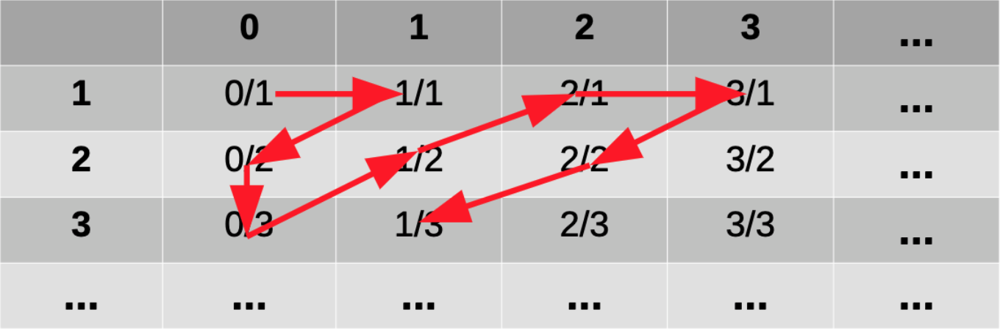

# **Day 1**
**Loom:** There are two options for each flip and four flips. You can't have all up or down, so the number of options is 2<sup>4</sup> - 2

### Pillars of CS Theory
#### Automata Theory
* Taking mechanical processes and seeing what can be done with them.
* **Domain:** values that are inputs to the function
* **Codomain:** all possible valid outputs of a function
* Types of functions
  * **One-to-one (injective):** no two values of the domain map to the same output (codomain value). ex: x + 1
  * **Onto (surjective):** all of the values in the codomain are mapped to. doesn't matter how many values in the domain map to each codomain value
  * **One-to-one and onto (bijective):** every single input in the domain has one and only one value in the codomain, and each value in the codomain maps to one value in the domain. D and CD are fully covered

#### Computability Theory
**Input:** Type in `7+2<enter>`, maps to ascii numbers (unique int values). Those ints can be represented as binary numbers (bitstream).  
**Output:** output displays on your screen, but those are just a variety of pixel values (location and darkness). The original bitstream is converted to the output bitstream, then converted to ints again, then pixels  
**Binary in, binary out**  
*Example, picture search:* "delicate arch" can be converted to ascii then binary. Basically the same but complex, you get back an output binary but in color  
1. | Fxn | D: CD |
   | ----------- | ----------- |
   | range() | int : list of ints |
   | length() | string : int |
2. *Can you precisely define a fxn that can't be defined in python? does one exist?* There are some things that can be written down mathematically that can't be computable (doesn't seem legit but it is). *Can you, as a human, analyze code and figure out if it will crash?* Nope. You cannot write a program that can analyze another program to tell you if it'll work
3. *Are there non-trivial ops that can be done in one language and not another?* We can do the same kinds of math. computations across languages. The set of fxns they can compute is equal

#### Complexity Theory
Order of alg, O() time  

### Math Background
* **Important math. sets**
  * N: set of natural numbers {1, 2, 3, ...}
  * Z: set of integers {..., -3, -2, -1, 0, 1, 2, 3, ...}
  * Q: set of rational numbers. x/y where x and y are both ints and y is not zero
  * R: set of real numbers
* **Sets:** collection of math. objects that is unordered and does not have repeats
* **Set Operations**  
  **A = {15,18. 4. 99, 101}** &nbsp;&nbsp;&nbsp;&nbsp;&nbsp;&nbsp; **B = {12, 87, 4, 42, 18}**
  * **Membership:** 15 E A
  * **Intersection:** A &cap; B = {18, 4}
  * **Union:** A &cup; B = {15, 18, 4, 99, 101, 12, 87, 42}
  * **Difference:** A - B = {15, 99, 101} (also A \ B)  
    A \ B = {x : x ∈ A and x ̸∈ B}
  * **Subset:** {4, 99} &SubsetEqual; A
  * **Powerset:** set of all possible subsets. the size of a powerset is 2<sup>n</sup> where n is the length of the og set. there are two options for each element in the set, on or off.  
  Ex: &#119979;({1, 2, 3}) = {{}, {1}, {2}, {3}, {1,2}, {1,3}, {2,3}, {1,2,3}}
  * **Cartesian product:** A × B = {(x, y) : x ∈ A and y ∈ B},
* **Proofs**
  * **Proof by contradiction:**  
    Theorem: if n<sup>2</sup> is odd, then n is odd.   
    Assume n2 is odd and n is even.  
    Since n is even, we can write it as n = 2x  
    Then we can rewrite n<sup>2</sup> as (2x)<sup>2</sup> = (2x)(2x) = 2(2x<sup>2</sup>).  
    This is 2(some_integer), so n2 must be even, but we assumed it was odd.  This is a contradiction, so our assumption must be false.
  * **Direct proof**
  * **Proof by induction**
  * **Proof by construction**
  * **Proof by exhaustion**
  * **...**
* **Alphabet:** a set of symbols  
  &sum; = {a, b, c}
* **Language:** a set of strings from a given alphabet  
  L = {aa, ab, a, ccb}  
  w = ccb  
  |w| = 3  
  The language in the delicate arch example is the combo of the input:output mapping pair. If one pixel were different it would no longer be in the language.
* **String:** over an alphabet Σ is a finite sequence of symbols, where each symbol is an element of Σ.
___
# **Day 2**
### **Some notes**
* a language can have infinite length
* each string in a language must be finite length
  * there is a finite size alphabet (arbitrarily large)
  * it would never get the end if there were inf. length strings

### Deterministic Finite Automata
* have finite memory
* if a string ends you in an accept state it is a valid string in the language
* if a letter is allowed in the alphabet, there must be an option for each state for that symbol. if there isn't one coming out and back, that is automatically a reject
> A 5-tuple (Q, Σ, δ, q, F )
  1. Q is a finite set, whose elements are called states,
  2. Σ is a finite set, called the alphabet; the elements of Σ are called symbols,
  3. δ : Q × Σ → Q is a function, called the transition function,
  the Cartesian intersection of all the sets and the alphabet. visually, the set of pairs that the table looks like
  4. q is an element of Q; it is called the start state,
  5. F is a subset of Q; the elements of F are called accept states.

*Can delta be infinite size?* No, because it is using two finite sets
F can be the empty set
#### DFA Computation
Given an input word, w...
Define a sequence of states r<sub>0</sub>, r<sub>1</sub>, ..., r<sub>n</sub>
&nbsp; r<sub>0</sub> = q<sub>0</sub>
&nbsp; r<sub>i+1</sub> = delta(r<sub>i</sub>, w<sub>i+1</sub>)
&nbsp; if r<sub>n</sub> is in F, then accept
&nbsp; if r<sub>n</sub> is not in F, then reject

#### Regular language
The language of a DFA, M, is given by:
&nbsp; L(M) = {w : w is accepted by M}
A language accepted by a DFA is called a **regular language**

#### Regular operations
Given two languages, A and B, with the same alphabet...
* **A U B:** the union of A and B is the set of all strings in one or the other
* **AB:** the concatenation of A and B is the set of all strings where a E A, b E B
* **A\*:** the star of A is any finite number of strings from A concatenated together, including the empty string
_Examples:_
  A = {ab, bb} &nbsp; B = {aaa, aab}
  A U B = {ab, bb, aaa, aab}
  AB = {abaaa, bbaaa, abaab, bbaab}
  A\* = {"", ab, abab, bbab,...}

**Regular languages closed under union**
**C = A U B:** if A and B are regular languages, then so is C
_To prove that C is a regular language, what do we have to do?_
&nbsp; Proof by construction, build a DFA, M, that accepts C
&nbsp; **Proof Idea:** build M by creating combined states snd transitions from A to B
**AB**
**A***
**Complement of A**
**Intersection of A B**

---
# **Day 4**
*Worksheet, #6:* We know that we have a rly long string compared to the memory of our DFA (the number of states represents the memory of the machine). We have a relatively small amount of memory with respect to the length of the input string that is accepted, so we know we have to reuse the memory. We know we wouldn't be able to keep track of each of the letters separately, so we must be reusing memory. Reusing memory means going back to some other state, so part of the computation is getting redone (there's a loop or cycle). **Very important that the accepted string overruns the capacity of the machine.** If we have a loop, we can go thru it more times, so any strings that go thru the loop more times must go over the loop. We can make it shorter by just not going thru the loop and directly to accept state.

*How does the formal definition of an NFA differ from a DFA?* The transition function is to a subset of states rather that one state. The alphabet contains the empty string epsilon.

*Is is always possible to build D so that |Q<sub>D</sub>| = |Q<sub>N</sub>|?* No, there will be more in the DFA

#### **Regular Expression Definition**
* epsilon is a regex
* empty set is a regex
  _one is a set that is truly empty, one is just a string with no characters_
* each single alphabet symbol ( a E Σ ) is a regex
* If R<sub>1</sub> and R<sub>2</sub> are regexes, then so are:
  R<sub>1</sub> U R<sub>2</sub>
  R<sub>1</sub>R<sub>2</sub>
  R<sub>1</sub>*

**Equivalence of Regex/Regular Languages**
**Theorem:** A language L is regular iff there is a regex that describes is.
  Regex -> L(M) for DFA/NFA M (Regular language)
  &nbsp;&nbsp;&nbsp;&nbsp;-AND-
  L(M) for DFA/NFA M -> Regex

#### **Regex -> NFA M**
**epsilon is a regex**
&nbsp;
_Implicit reject if anything other than the empty string is fed in_
**empty set is a regex**
&nbsp;
_Everything is rejected, even empty string_
**Each single alphabet symbol (a E Σ) is a regex**
&nbsp;
**If R<sub>1</sub> and R<sub>2</sub> are regexes, then so are:
  R<sub>1</sub> U R<sub>2</sub> -
  R<sub>1</sub>R<sub>2</sub> - concat the two machines with epsilon
  R<sub>1</sub>* - loop back to the first real state (the one after epsilon)**
_Example: construct NFA for a(a U bb)*bb_


#### **NFA M -> Regex**
**Recurrence relations:** We will have variables defined using themselves
We look at a state and want to know what's the language starting at that step that is accepted
L<sub>q0</sub> = aL<sub>q0</sub> U bL<sub>q1</sub>
Add on the language that is accepted at each state to the language
L<sub>q1</sub> = aL<sub>q1</sub> U bL<sub>q2</sub>
L<sub>q2</sub> = aL<sub>q0</sub> U epsilon (could go back or just not process any more symbols. **Only add when it's an accept state**)


Now... substitution!!
* Language of the machine is the language of the start state
* Take the definition of Lq2 and substitute into where you see Lq2 (luckily there is no self reference to Lq2 in the definition)
L<sub>q0</sub> = aL<sub>q0</sub> U bL<sub>q1</sub>
Add on the language that is accepted at each state to the language
L<sub>q1</sub> = aL<sub>q1</sub> U b**(aL<sub>q0</sub> U epsilon)** = aL<sub>q1</sub> U baL<sub>q0</sub> U b
* Now the bitch...
> Lemma: Rewriting recursively defined languages of the form L = BL U C
Suppose string v E L
Two cases for v:
  * v E C
  * v E BL, v = bv'
    b is a character form B
    v' is another string from L  
Two caes for v':
  * v' E C
  * v' E BL, v = bbv''
  ...
__L = B*C__
<mark>COPY NOTES</mark>

#### **Pumping Lemma**
**A tricky language!**
L = {0<sup>0</sup>1<sup>n</sup> : n >= 0}
Must be the same amount of 1s and 0s
_Why is it tuff?_
* strings can be arbitrarily big
* you need to keep track of how many 0s there are and 1s

**This language is not regular,** we can't make a DFA or NFA for it

The rly long string will be split up into three substrings: x, y, and z
* x is the part of the string that occurs before it reaches a loop
* y is the all of the characters that are processes while doing the loop, or the **first loop that the string encounters**
* z is all of the characters that are processed after you're done with the loop and go to the accept state. **everything after the first loop**
> __Pumping Lemma__
Let A be a regular language. There exists an integer, p >= 1.
Then every s E A with |s| >= p can be written as s = xyz
  1. y =/= epsilon (empty string)
  y can't be empty because there HAS to be a loop. no such thing as an empty loop
  y is just the characters in the first length
  2. |xy| <= p
    __p is the pumping length, capacity of the machine. roughly the number of states in the machine__
    _Why does the length of xy have to be less than p?_ We know that x before the loop and y (one time around the loop) can't be bigger than p because p is the number of states
  3. For all i >= 0, xy<sup>i</sup>z E A
    the i exponent is repeating the characters of the loop
    there can be strings longer than s that are strings in the regular language

___Using the pumping lemme to prove non-regularity___ _via proof by contradiction_
**L = {0<sup>0</sup>1<sup>n</sup> : n >= 0}**
Assume L is a regular language, so there exists a pumping length p.
Consider w = 0<sup>p</sup>1<sup>p</sup>
|w| > p (must be length 2p)
**Clearly** w E L
By the pumping lemma, **|xy| <= p**
So y = 0<sup>k</sup>, for some k > 0

Oh no! xy<sup>2</sup>z will not be in L because there will be too many 0's, but it should be because of the pumping lemma! **Contradiction!**

**Another one**
**L = {1<sup>n<sup>2</sup></sup> : n >= 0}**
Assume L is a regular language, so there exists a pumping length p.
Consider w = 1<sup>p<sup>2</sup></sup>
Clearly w E L
|w| = |xyz| = p<sup>2</sup>
|xy<sup>2</sup>| = |xyz| + |y| = p<sup>2</sup> + |y|
&nbsp;&nbsp;&nbsp;&nbsp;Pump up the y, so it's now xyyz. We know that |xyz| = p<sup>2</sup>, so that plus |y|
1 <= |y| <= p (since |xy| <= p and y =/= epsilon)
&nbsp;&nbsp;&nbsp;&nbsp;|y| must be greater than one bc you can't have no loops. it must be smaller or equal to p because you can't go around to more states than you have
So |xy<sup>2</sup>z| is in the range [p<sup>2</sup> + 1, p<sup>2</sup> + p]
But the next square is (p +1)<sup>2</sup> = p<sup>2</sup> + 2p + 1 so |xy<sup>2</sup>z| is not in L, which is a contradiction.

**Strategies**
* boiler plate
* we want a specific string that uses p and the length of w has to be >= p
* to show something is regular build a DFA, NFA, regex...
* spend time getting the right string
---
# **Day 6**
When the memory requirements grow in respect to the input string, it's probably a non-regular language. Or if a finite number of states will not work because you need more states as the string grows.

___Is multiplication regular?___
L = {a<sup>x</sup>b<sup>y</sup>c<sup>z</sup>: x * y = z}
ex. aabbcccc, no, doesn't seem regular
**Proof**
Assume L is a regular language, so there exists a pumping length p.
Consider w = a<sup>p</sup>b<sup>2</sup>c<sup>2p</sup>
Clearly w E L
By the pumping lemma, |xy| <= p
So y = a<sup>k</sup>, for some k > 0
xy<sup>2</sup>z will not be in L because it will have the same number of b's and c's as xyz, but more a's.
xy<sup>2</sup>z should be in L because of the pumping lemma, so this a contradiction!
#### **POSIX**
<mark> GET SCREENSHOTS FROM SLIDES
MAYBE MAKE BELOW INTO A TABLE</mark>
**grep: + operator**
grep -E "aa+"
**grep: [] operator**
grep -E "a[ab]b"
**grep: . operator**
grep -E "a.b"
the dot is defining a finite set of possibilities
**Matching a repeated pattern**
echo "baba" | grep -E "(ba)\1"
repeat that group that you matched that was your first group
**Matching *any* repeated pattern**
grep -E "(..)\1"
**Matching any repeated *repeating* pattern**
grep -E "(ba*b)\1"
Hmmm, if you loop at one state for a's you can't remember the number of a's later
We can't count up all those a's! not enough memory!

**POSIX extended regular expressions are not regular!!**
#### **Context-free languages**
**Formal Grammar**
&nbsp;&nbsp;&nbsp;&nbsp;S -> A
&nbsp;&nbsp;&nbsp;&nbsp;A -> aAbb
&nbsp;&nbsp;&nbsp;&nbsp;A -> epsilon
* Each line is a production rule
* Capital letters are variables
* Lower case letters are terminals
* One variable is the special start symbol, we use S
* Two expansions for the same variable indicate a choice to be made: non-determinism

**Producing legal strings**
S
A
aAbb (replace variable A with aAbb)
aaAbbbb
aaebbbb = aabbbb
*This string is in the language of the grammar because it can be produced*
> **Context free grammar definition**
* V = set of variable characters
* Σ = set of terminal characters
* S E V, the start variable
* R = set of production rules
 <mark>FINISH</mark>

___Example___
{0<sup>n</sup>1<sup>n</sup> : n >= 0}
V = {A}
Σ = {0, 1, e}
S = A
R = {A -> e, A -> 0A1}

> **Context-free languages**
Given a CFG, G, the language of G, L(G), is defined as the set of all strings that can be derived from the start variable

With a CFG of A->1A, the language would be e
#### **ANTLR: Another Tool for Language Recognition**
You define a CFG and it automagically produces a lexer (breaks down a program string into tokens), parser (builds parse tree of the structure based on the grammar), and listener (waiting for smth (text) to happen) for you

**Addition is not regular but is context-free**
L = {a<sup>x</sup>b<sup>y</sup>c<sup>z</sup>: x + y = z}
A -> aAc | B
B -> e | bBc
Adding a c in both expansion steps, so we should get the right number of c's

**Well-Formed arithmetic expressions are Context-free**
S -> E
N -> 0 | 1 | 2 | ... | 9
<mark>need more?</mark>

#### **Context free vs. Context-Sensitive**
<mark>screenshot</mark>
Context-sensitive languages are a larger set than context-free and more powerful

**Regular languages are Context-free**
Given a DFA, D, we need to show that there exists a CFG, G, such that:
&nbsp;&nbsp; L(D) = L(G)
Given a string, w E L(D), show that G can produce w.
_Make the state a variable, i.e. Q<sub>0</sub> -> aQ<sub>1</sub>_
<mark>screenshot</mark>

#### **Chomsky Normal Form (CNF)**
Normalize the production rules so that we know **how many steps** are required for derivations.
Manipulate the grammar so we can count how many steps it takes to form any string.

A CFG is in CNF if each production rule is one of the following forms:
* **A -> BC**
  A, B, C are variables and B and C are not start
* **A -> a**
  A is a variable and a is a terminal (ONE TERMINAL. not two terminals, not terminal and variable)
* **S -> e**
  The only legal transition to epsilon is from the start variable

If you want a string that you know to be 3 symbols, you need to expand A twice (lose one add two), then three steps to replace the variables with the terminals.
<mark>finite</mark>
Since there is no transition to epsilon, this is EXACTLY the number of steps required
___
# **Day 7**
#### **Pushdown automata**

The PDA can use its stack to remember things (unlike DFA/NFAs!)
* **Stack: The stack is not limited in size, can get arbitrarily large. It is separate from the states in the *state control***

To accept the string:
* We have to get to the end of the stack
* Our pointer must be at the end of the string (well, one past in that whitespace)

If you see anything left when you're at the end of the stack, REJECT!
What if you give it 0101? When it hits the second 0, it should know that it's no longer in the start state so it would reject.
> **Pushdown automata Definition**
  * Σ = tape alphabet
  * Γ = stack alphabet (contains $)
  * Q = finite set of states
  * q<sub>0</sub> = the start state
  * = transition function
  __Q x (Σ u {□}) x Γ -> Q x {N,R} x Γ*__
  Pick either N (no movement) or R (move the pointer one cell to the right)
  0 or more junk from the stack alphabet. If nothing is pushed, the stack gets smaller bc one was popped with the first Γ. You can put an arbitrary amount of symbols onto the stack during each step.

> __Pushdown Automata Instructions__
  Given:
  * q,q' E Q
  * a E Σ
  * a' E {N,R}
  * g E Γ
  * g' E Γ*
Function assignment:
* <mark> FINISH THIS SHIT WTF</mark>

**PDA Language:** Given PDA, M, its language is given by
  L(M) = {w : <mark>finish</mark>}

#### **Non-deterministic PDA Definition**
__Q x (Σ u {□}) x Γ -> P(Q x {N,R} x Γ*)__ where P is the powerset
It's like running multiple copies of the machine at the same time

#### **Context-free pumping lemma**
Let L be a CFL. There exists an integer, p >= 1.
Then every s E L with |s| >= p can be written as s = uvxyz
1. |vy| >= 1
2. |vxy| <= p
3. For all i >= 0, uv<sup>i</sup>xy<sup>i</sup>z E L
When we do a variable expansion, we could have expanded it different ways


Everything that occurs before the repeated variables is u, and everything after is z
Everything the upper variable expands to is vxy
The lower variable expands to x
Must have a repeated variable R because we chose a long string.
**Parse tree height vs string length**
If the height is greater than the number of variables, there must be a repeated variable
Three things you think about: length of the string, height of the tree, and number of variables
|w| <= 2<sup>h-1</sup>
**Choose pumping length**
Go back to the number of variables, r
Set pumping length p = 2<sup>r</sup>
This forces h > r
Pick the repeated variables that are the two that are furthest down the longest path on the parse tree
Both occurrences must be in the last r+1 variables of the path (because there are only r variables total)
The top one at the highest can be at r+1
We are guaranteed to get a repeat |w| steps up in the parse tree

___
## **Day 8**
#### **Turing Machines**
* A new kind of machine that can work for non-context-free languages
* Computationally equivalent with our intuitive definition of algorithm or computer
* Cool things about it:
  * we can move the pointer to the left or right
  * we have arbitrarily large tapes

> **Definition**
* Σ = input alphabet
* Γ = tape alphabet (Σ ⊆ Γ)
  * common to add a lot of symbols to the tape alphabet than input, can be the same symbols
* Q = finite set of states
* q<sub>0</sub> = the start state
* q<sub>accept</sub> = the accept state
* q<sub>reject</sub> = the reject state
* δ = transition function (with k tapes)
  **δ: Q x Γ → Q x Γ x {L,N,R}**
  **δ: Q x Γk → Q x Γ<sup>k</sup> x {L,N,R}k**

##### **Turing machine instructions**
Given:
q, q' E Q
a, a' E Γ
σ' E {L, N, R} *sigma is the movement of the read/write head*
For a machine with one tape:
qa → q'a'σ'
For a machine with k tapes:
q<sub>a1</sub>...a<sub>k</sub> → q'a'<sub>1</sub>...a'<sub>k</sub>σ'<sub>1</sub>...σ'<sub>k</sub>

##### **TM Computation**
&nbsp;**Start configuration:**
&nbsp;&nbsp;Start in the start state, q<sub>0</sub>
&nbsp;&nbsp;Tape head is on the leftmost symbol
&nbsp;&nbsp;First tape contains the input string
&nbsp;&nbsp;Other k-1 tapes are empty
&nbsp;
&nbsp;**Computation:**
&nbsp;&nbsp;Change states and tape positions and contents based on inst4ructions
&nbsp;&nbsp;Terminante when in q<sub>accept</sub> or q<sub>reject</sub>
&nbsp;&nbsp;If the TM never enters q<sub>accept</sub> or q<sub>reject</sub> then *never terminate*
##### **TM Language**
Given TM, M, its language is given by L(M) = {w : M accepts w}

***Example***
__Write out TM instructions to match strings that are palindromes in {a, b}*__

| STATE | INSTRUCTIONS |
| ----------- | ----------- |
| q<sub>0</sub>  | the start state |
| q<sub>a1</sub> | leftmost was a: go right |
| q<sub>a2</sub> | test rightmost for a |
| q<sub>L</sub>  | back to the leftmost |
| q<sub>b1</sub> |  leftmost was b: go right |
| q<sub>b2</sub> |  test rightmost for b |


> **Describing TMs**
**Formal description:** all states and transitions are completely definited
**Implementational description:** prose describing how a TM moves its read/write head and how the contents of the tape change
**High-level description:** an algorithm description that ignores the TM details
&nbsp; "you make sure the first and last character match"

***Examples***
{w#w : repeated {a, b}* strings with # in the middle}
_Implementation description?_

| STRING | INSTRUCTIONS |
| ----------- | ----------- |
|abba#abba | Starting input |
|xbba#abba | Cross off and remember the left a |
|xbba#xbba | First right a matched |
|xxba#xbba | Back to the leftmost symbol |
|xxba#xxba | Cross off its match on the right |
|... | |
|xxxx#xxxx | Accept if everything is crossed off |

{a<sup>x</sup>b<sup>y</sup>c<sup>xy</sup>: multiplication}
_Implementation description?_ Steps:
1. Check input is of the form: a\*b\*c\*
2. Erase the leftmost a
  Go to the leftmost b
  Zigzag between leftmost b and rightmost
  c, marking them off with special
  characters
3. Return each former b back to normal
4. Repeat Steps 2 and 3 until all a's are erased or something goes wrong

| STRING | INSTRUCTIONS |
| ----------- | ----------- |
|aabbbccccc | Starting input |
|xab'bbccccx | Erase leftmost a, go to leftmost b. Erase rightmost c |
|xab'b'bcccxx | Zigzag between leftmost b and rightmost c, marking them off with special characters |
|xb'b'b'ccxxx |  |
|xxbbbcccxxx | Return each former b back to normal |
|... | Repeat the above steps for each remaining a |

**TM "subroutine" for string copying**
Suppose we have a TM with a string, w, somewhere on its tape

How could a TM copy this string to the end of its tape where there are blank spaces?

1. Find the beginning of the substring we wanna copy. We need a state that remembers that we have an a that we need to copy.
2. Mark the first a so we don't reuse it
3. Move over to the blank space, mark the character we were carrying
4. Move back to the first unmarked symbol then repeat

**TMs with k tapes can be converted to TMs with a single tape!**
Let M be a TM with k tapes.
We will construct a TM, N, with one tape, where L(M) = L(N)

The K tape machine has three pointers for each tape. All of the steps happen concurrently in the k tape
Put a special symbol above what the k tape machine pointers are looking at
Wait! Those k tapes can infinite length.... we're out of room. What do we do? We must use the same idea of copying the substring to copy a later chunk and move it further right

##### **Non-Deterministic TM Definition**
* Σ  = input alphabet
* Γ  = tape alphabet (Σ ⊆ Γ)
* Q  = finite set of states
* q<sub>0</sub>  = the start state
* q<sub>accept</sub>  = the accept state
* q<sub>reject</sub>  = the reject state
* δ  = transition function
δ: Q x Γ →  (𝒫Q x Γ x {L,N,R})

If ***any*** configuration is an accepting configuration, then the TM accepts
Can we ***deterministically*** search for this accepting configuration? Well, what if the TM gets stuck on a bad path that never terminates? Each configuration has its own version of the state machine. We could come up with a string that represents the configuration. We should do this in a **breadth first** way so we don't get stuck in a hole. Running everything on multiple tapes is very similar to BF because you're making a move concurrently on each tape.

_Why would DFS be nice?_ The memory that it takes to store one path is the depth of the tree, which is much smaller than how big the levels get

* Tape 1: input string
* Tape 2 execute the machine using the choices from Tape 3
* Tape 3 represents a deterministic choice about which child to hit next; how to traverse the tree
  If we haven't accepted and repeated a configuration, we should stop. If it fails, write out the next tree index (the next lexicographical string)

***Non-deterministic TMs are equivalent to deterministic TMs!***
##### **Church-Turing Thesis**
Anything that can be computed, can be computed by a Turing machine.
A Turing machine is as _powerful as any modern computer)_.
Any device that is equivalent to a Turing machine is said to be ***Turing Complete***.


---
## **Day 11**
_PDAs and TMs both have infinite storage mechanisms, so why are TMs more powerful?_
* TM can move both directions
* TM can have contaxt
* PDAs have a purposely limited data structure

#### **Linear Bounded Automata**
___What if we had something exactly like a TM,  but the tape size is limited?___
> **Definition**
* Σ  = input alphabet
* Γ  = tape alphabet (Σ ⊆ Γ)
  &nbsp; &nbsp; (Also includes two special symbols for left and right tape endpoints, [ and ])
* Q  = finite set of states
* q<sub>0</sub>  = the start state
* q<sub>accept</sub>  = the accept state
* q<sub>reject</sub>  = the reject state
* δ  = transition function (with one tape)
δ: Q x Γ → Q x Γ x {L,N,R}
δ: Q x {]} → Q x {ε} x {L,N}
δ: Q x {[} → Q x {ε} x {R,N}

*Is this equivalent to a DFA??* You have a finite number of states, alphabet, tape, etc, so does it have a finite number of configurations?
Yes, there are a finite number of configurations! But it's different from a DFA because we change the size of the finite sized tape based on the length of the input string
Why would we care? We want to know the time and space complexity for an input for an algorithm
***Language Example***
Recall: We proved that the following language is not context-free: {a<sup>n</sup>b<sup>n</sup>c<sup>n</sup> : n ≥ 0}
> ___Context-Sensitive Grammar Definition___
* V = set of variable characters
* Σ = set of terminal characters
* S ∈ V, the start variable
* R = set of production rules of the form:
  **αAβ → αγβ**
  &nbsp;&nbsp; where A ∈ V
  &nbsp;&nbsp; α, β ∈ (Σ ∪ V)*
  &nbsp;&nbsp; γ ∈ (Σ ∪ V)+
  <mark>what do these mean</mark>

Context sensitive grammar for above language:
* S → aBC
* S → aSBC
* CB → CZ
* CZ → WZ
* WZ → WC
* WC → BC
* aB → ab
* bB → bb
* bC → bc
* cC → cc
Having a terminal and variable or two variables makes it context sensitive
CB → BC isn't legal because which variable are you expanding?? Which is the context??

*What about an LBA for this language?*

Can you just mark off the a's and b's like x's on the tape? No, you'd need symbols that are specific to a b and c

#### **Post tag system**
**Turing Complete!**
> **System definition**
* m = 2
* Σ = { a, b, c, H } H is halt, stop the computation
* δ = { a → abb
  &nbsp; &nbsp; &nbsp; &nbsp; &nbsp;b → Ha
  &nbsp; &nbsp; &nbsp; &nbsp; &nbsp;c → cb }
Chop off the first two characters, use the first of that to add onto the end. Stop once there is an H at the front

***Example computation***
abc
&nbsp; &nbsp; &nbsp;cabb (chop off first two bc m is 2)
&nbsp; &nbsp; &nbsp; &nbsp; &nbsp; &nbsp;bbcb
&nbsp; &nbsp; &nbsp; &nbsp; &nbsp; &nbsp; &nbsp; &nbsp; cbHa
&nbsp; &nbsp; &nbsp; &nbsp; &nbsp; &nbsp; &nbsp; &nbsp; &nbsp; &nbsp; &nbsp;Hacb

**Collatz Conjecture**
f(n)=n/2 if n is even
f(n)=3n+1 if n is odd
*Do repeated applications of this function always end up with the number 1?* **Yes!**

#### **Queues**
**Turing Complete!**

#### **Counter machine**
**Turing Complete!**
Two holes and infinite rocks is Turing-complete! Basically just two integers with two operations + -
You can have registers with an integer in each with a set of instructions


***Example:*** Add r<sub>0</sub> and r<sub>1</sub>
1. JNZ(0,3)
2. JMP(6)
3. INC(r<sub>2</sub>)
4. DEC(r<sub>0</sub>)
5. JMP(1)
6. JNZ(r<sub>1</sub>, 8)
7. HALT
8. INC(r<sub>2</sub>)
9. DEC(r<sub>1</sub>)
10. JMP(6)

#### **Random-Access Machines**


Copy the value that register 0 is POINTING AT (not the value in 0) to register 4

---
## **Day 17**
#### **Penttonen Noraml Form**
Grammars have to have all rules follow the following forms:
* AB → AD
* A → BC
* A → a

#### **Decidability**
A language, L, is ___decidable (or recursive)___ if there exists a TM, M, that terminates correctly on every input string w.
if w ∈ L, M terminates in the accept state
if w ∉ L, M terminates in the reject state
**Notice: M always terminates!**
A language that is not decidable is called **undecidable**.
*Proof ideas:* Assume a language is decidable, then prove contradiction.

**Encoding Computational Models**

We need to put other models on the tape of the TM.
So this looks like (with input): **3#0#2#2#,1#1,1#2,2$011**

#### **Encoded model**
Given a model M and a string input w:
<M,w> = the binary encoding of M followed by the binary encoding of w.

**A<sub>DFA</sub>** = { <M, w>: M is a DFA that accepts w}
Is A<sub>DFA</sub> decidable?
**Yes.**
If the input does not have a legal encoding of a DFA, then reject. (No infinite loop)
Otherwise a TM can reconstruct M and then run M on w. (No infinite loop)

**A<sub>NFA</sub>** = { <M, w>: M is a NFA that accepts w}
Is A<sub>NFA</sub> decidable?
**Yes**
First convert the NFA into an equivalent DFA. (No infinite loop)
Run the DFA and return its result.  (No infinite loop)

**A<sub>CFG</sub>** = { <M, w>: M is a CFG that accepts w}
Is A<sub>CFG</sub> decidable?
**???**
We can have non-terminating expansions:
CFG
* S → AB
* A → BB | a | ε
* B → AAA | b | ε

**CHOMSKY - YES**
First convert the CFG into CNF.  (No infinite loop)
Try all derivations of length: 2n-1 (n = |w|).  (No infinite loop)

**A<sub>LBA</sub>** = { <M, w>: M is a LBA that accepts w}
Is A<sub>LBA</sub> decidable?
An LBA is almost identical to a TM, but we bind the tape in respect to the length of the input string.
**Yes.**
Run M on w for at most the following # of steps:
**QCΣ<sup>C</sup>** <mark>WHY IS THIS TRUE</mark>
where:
  * Q is the number of states
  * C is the number of tape cells
  * Σ is the alphabet
So this is every possible combination of states, position of the tape head, and all of the combinations of symbols in each cell.
If we have one more step, there's gotta be a repeat. So if no accept or reject has been hit by this number, by the pigeon hole principle there would have to be a repeat, and subsequently an infinite loop.

**A<sub>TN</sub>** = { <M, w>: M is a TM that accepts w}
Is A<sub>TM</sub> decidable?
Well, let's get funky....
```
def decider(function, input_string):
  # If function would return True on input_string
  # then return True
  # If function would return False on input_string
  # then return False
```
```
def alwaysTrue(input_string):
  # Ignore input_string and just return True
  return True
```
```
def inputIsBig(input_string):
  if len(input_string) > 17:
    return True
  else:
    return False
```
```
def rudeReverser(input_string):
  # Decode input_string as a function
  function = decodeStringToFunction(input_string)
  # Run decider on that function with
  # input_string as input.
  decider_result = decider(function, input_string)
  # Return opposite value as decider
  return **not** decider_result
```
```
def main():
  print decider(alwaysTrue, “IHEARTTMS”)
```
We can't have a decider that works on every function (because we had the self reference and reversal)
**NO. A<sub>TM</sub> is not decidable**
_Why can’t we just build M from the description, run it on w, and accept if M accepts and reject if M rejects?_
***Proof:***
Assume A<sub>TM</sub> is decidable and TM D decides it.
Define TM R (Rude Reverser) that takes input ⟨M⟩:
&nbsp; R runs D on ⟨M, ⟨M⟩⟩
&nbsp; R returns the opposite result
Run R on input ⟨R⟩?
<mark>WHAT THE FUCK IS GOING ON</mark>
<mark>fill some things in </mark>

#### **Connection with Countable/Uncountable infinities**
Recall:
&nbsp;ℕ: set of natural numbers {1, 2, 3, ...}
Any set that is finite or has a bijection (one-to-one and onto) with ℕ is said to be **countable**.

**ℤ is Countable**
ℕ: set of natural numbers {1, 2, 3, ...}
ℤ: set of integers {...,-3, -2, -1, 0, 1, 2, 3, ...}:
We need a function ƒ that is a bijection between ℕ and ℤ.
Arrange elements of ℤ in this order:
&nbsp; 0, 1, -1, 2, -2, 3, -3, ...
Every element has a very specific index
ƒ(x) = x/2  if x is even
&nbsp; &nbsp; &nbsp; &nbsp;= -(x-1)/2  if x is odd
Plug in the natural number (index) to get WHAT Z is stored at that index.
***Z is countably infinite***

**ℚ is Countable**
ℚ: set of rational numbers.  x/y where x and y are both integers and y is not 0
We need a function ƒ that is a bijection between ℕ and ℚ.
Arrange elements of ℚ in a table:


The order of Q
The step number is the corresponding natural number (think of index where the order is the snake. STARTS AT 1 because 0 isn't a natural number)

**ℝ is Uncountable**
ℝ: set of real numbers.
There is no function ƒ that is a bijection between ℕ and ℝ.  And no bijection between ℕ and an interval subset of ℝ, {x: 0 ≤ x ≤ 1}
***Proof:***
Assume leading to contradiction that there is a bijection ƒ from ℕ to {x: 0 ≤ x ≤ 1}:
Then we can write out each corresponding value ƒ(x) in decimal form:
f(1) = 0.3871643948827364...
f(2) = 0.7738395004947231...
f(3) = 0.9248472021125333...
...
Since ƒ is a bijection, each x from {x: 0 ≤ x ≤ 1} should appear **exactly once** on the right-hand side.
Let's create a number, y, in the following way: (a real number that cannot be anywhere in the bijection)
&nbsp; &nbsp; y = 0.4 (doesn't match the first line, 0.3)
&nbsp; &nbsp; y = 0.44 (doesn't match the second one because 0.x7)
&nbsp; &nbsp; y = 0.445 (doesn't match the third because 0.xx4)
So y is in {x: 0 ≤ x ≤ 1}, but it does not appear on the right-hand side of the bijection.
The real numbers kind of infinity is **BIGGER THAN** the natural numbers kind of infinity.
There are more things in the real numbers than the natural numbers.
So we cannot have a bijection and {x: 0 ≤ x ≤ 1} must be bigger.

#### **Diagonalization for Halting Problem**
Every TM can be encoded in a finite length binary string <M>.
We can build a table with both rows and columns corresponding to particular TMs:

The columns are strings and the rows are TMs. Would a TM stop on an input that is an encoded TM?
"Does TM<sub>1</sub> halt when given <TM<sub>2</sub>> as input?"
***RudeReverser*** is a TM so it must be somewhere in the table...

We need to reverse if a machine halts on itself.
How can you reverse the output of the reverse... 0 and 1 at the same time!!!!

---
## **Day 18**
#### **Enurmerability**
> A language, L, is **enumerable** (aka recursively enumerable, Turing-recognizable, recognizable) if there exists a TM, M, (called a ***recognizer***) such that on input w:
* if w ∈ L, M terminates in the accept state
* if w ∉ L, M either terminates in the reject state OR loops forever
  (this is different because the decider doesn't include the loop forever. yuck. so if you feed in something that's not in the language it could run forever)

**Every decidable language is enumerable**
Given a decidable language, L, there exists a TM decider, D<sub>L</sub>, that always halts.
Notice that the existence of D<sub>L</sub> means that L is enumerable.

A<sub>TM</sub> = {⟨M, w⟩: M is a TM that accepts w}
***Recall that A<sub>TM</sub> is undecidable.***
Create TM U that takes an input ⟨M, w⟩:
&nbsp; U simulates M running on w
&nbsp; If M accepts w:
&nbsp; &nbsp; &nbsp; U accepts
&nbsp; Else if M rejects w:
&nbsp; &nbsp; &nbsp; U rejects
&nbsp; Else if M loops forever:
&nbsp; &nbsp; &nbsp; U loops forever
**U is called a Universal Turing Machine (UTM) because it can simulate another TM's execution**

The strings may not only be printed once, but they will be printed at least once.

**A Language, L, is Enumerable iff it has an Enumerator**
Assume E<sub>L</sub> is an enumerator for L.
For any w, run E<sub>L</sub> and every time E<sub>L</sub> is going to print, check if string to be printed is w.  
Accept if w is to be printed.
Assume L is enumerable and M is a recognizer that terminates and accepts any w in L.

Issue! The recognizer is just going to loop forever if it never terminates... Should we run it for a set number of steps? What if that's not enough.... Add more steps and try again? Don't let it run forever, but don't give up on it. So how?

Consider an ordering of binary inputs:
&nbsp; &nbsp; 0, 1, 10, 11, 100, ...
Create an enumerator for L:
&nbsp; &nbsp; n = 1
&nbsp; &nbsp; while true:
&nbsp; &nbsp; &nbsp; &nbsp; Run M on the first n inputs for n steps
&nbsp; &nbsp; &nbsp; &nbsp; Print each input that M accepts
&nbsp; &nbsp; &nbsp; &nbsp; n++


You are not only running that many inputs, but you are running all of those inputs for that many steps. 10 could only accept after 9 steps since the first time you run it you only run 3.   

**How many enumerable languages are there?**
ℰ = {A : A ⊆ {0, 1}∗ is an enumerable language}
Notice each element of ℰ is a language (a set of strings).
How big is ℰ?
From the definition of enumerable:
&nbsp; Each enumerable language, L, must have a TM recognizer that accepts all strings in L.
Each TM can be described by a **finite-length string**.
Each string can be converted to binary.
We have a bijection, so ℰ is the same size as this set of binary-encoded TMs, we'll call S.
We can put the S in *lexicographical* (dictionary) order with shorter strings first (aka shortlex ordering).


***So ℰ is countable.***

**How many languages are there??**
ℒ= {A : A ⊆ {0, 1}∗ is a language}
ℒ is the set of all languages!
#### **ℒ is Uncountable**
Steps:
1. Show the set of all infinite length binary sequences, ℬ , is uncountable
2. Show ℒ and ℬ are the same size

**Step 1:**
Assume that there is a bijection ƒ from ℕ to ℬ:
Then we can write out each corresponding value ƒ(x) in decimal form:
&nbsp; &nbsp; &nbsp; &nbsp; f(1) = 10010110111101010101001...
&nbsp; &nbsp; &nbsp; &nbsp; f(2) = 00010111010101000100101...
&nbsp; &nbsp; &nbsp; &nbsp; f(3) = 11110101011011011101010...
&nbsp; &nbsp; &nbsp; &nbsp; ...
Since ƒ is a bijection, each binary sequence from ℬ should appear exactly once on the right-hand side.
Here's a sequence in ℬ:
&nbsp; &nbsp; &nbsp; &nbsp; 010...
&nbsp; &nbsp; &nbsp; &nbsp; WAIT! this one isn't there.....
So it's different from all the sequences mapped to by ƒ. **Contradiction!**

**Step 2:**
ℒ is the same size as ℬ
Show there is a bijection ƒ from ℒ to ℬ:
Each element of ℒ is a language (a set of strings!)
We can use the lexicographical ordering of all binary strings and then mark which strings are actually present in each particular language

Consider an example language:
A = {1, 10, 11}

We have a correspondence between each language and a binary sequence
We just showed that there are an uncountably infinite number of binary sequences, so there must be an uncountably infinite number of languages. ***Since there are a countable number of enumerable languages, and there are an uncountably infinite number of languages, there must be languages that are outside of the Venn diagram. In fact, there are INFINITELY MANY LANGUAGES outside of the diagram that are not even TM recognizable!***

#### ***Example:***
A language, A, is decidable iff A and &#256; are enumerable.
*Proof*: A is decidable → A and &#256; are enumerable
Assume A is decidable.  Then there is a TM, D, that always terminates correctly for A.

| Build a recognizer for A: | Build a recognizer for &#256;: |
| ----------- | ----------- |
| Run D on the input<br />Accept if D accepts<br />Reject if D rejects | Run D on the input<br />Reject if D accepts<br />Accept if D rejects |

Every string has got to be in A or not in A. We can't run these sequentially though because one might get stuck. So why don't we switch back and forth until one accepts.

Assume A and &#256; are enumerable with recognizers RA and R<sub>&#256;</sub>.
Build a decider for A:
&nbsp; On 2 tapes, run RA and R<sub>&#256;</sub> in *parallel*
&nbsp; &nbsp; &nbsp; If RA accepts, then accept
&nbsp; &nbsp; &nbsp; If R<sub>&#256;</sub> accepts, then reject

**Is &#256;<sub>TM</sub> enumerable?**
We know A<sub>TM</sub> is enumerable because we just created a recognizer for it.
If we had a recognizer for <span style="text-decoration:overline">HALT</span> we would have a decider for it, which we know we can't.
**So <span style="text-decoration:overline">HALT</span> is not enumerable.**


#### **Non-enumerable languages**
EQ<sub>TM</sub> = {⟨M1, M2⟩: L(M1) == L(M2)}
Can a TM determine if two other TMs have the same language?
**No! This language is not even enumerable! And neither is <span style="text-decoration:overline">EQ</span><sub>TM</sub>**
If we were to assume EQ<sub>TM</sub> is enumerable, we would be able to build a **<span style="text-decoration:overline">HALT</span> recognizer**, which we KNOW we cannot do, so this is a contradiction!
What's a string in EQ<sub>TM</sub>? EQ<sub>TM</sub> = {<M<sub>1</sub>, M<sub>2</sub>>} (if we decode these machines and run them, they accept identical languages)

Alright, how do we do this? Let's create a new machine that is a recognizer for <span style="text-decoration:overline">HALT</span>:
**<span style="text-decoration:overline">HALT</span> recognizer:**
Given ⟨M, w⟩
Create:
TMw:
Run M on w
Accept
Notice: Accept if M
terminates

| T<sub>Mw</sub>: | M<sub>1</sub>: |
| ----------- | ----------- |
| Run M on w<br />Accept<br />| Reject every input |
| *Notice: Accept if M terminates* | *Notice: L(M<sub>1</sub>) = ∅* |
| This basically runs M on w as a blocking subroutine | |
| If these two machines have the same language of the empty set, M on w never halted. ||

Then run: REQTM on <M<sub>1</sub>, T<sub>Mw</sub>>
(We're assuming this recognizer for EQTM exists.)
REQTM must accept when M1, TMw have the same language.
REQTM accepts when TMw has language, ∅.
TMw only has language, ∅, when M doesn't halt on w.
If REQTM loops forever, the whole NOTHALT recognizer loops forever.

---
## **Day 19**
