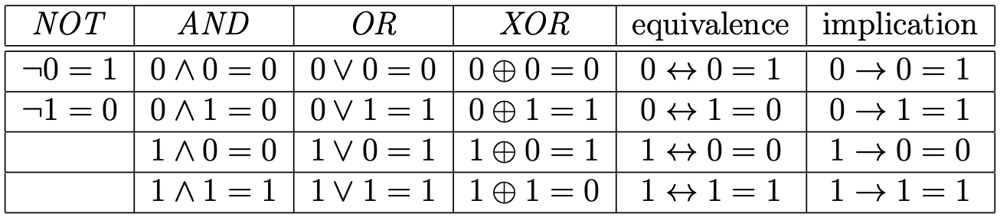
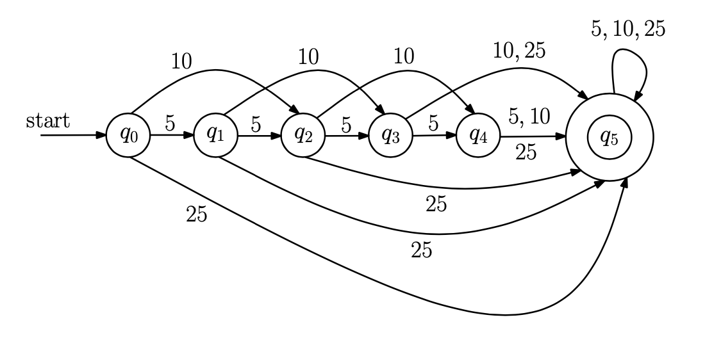
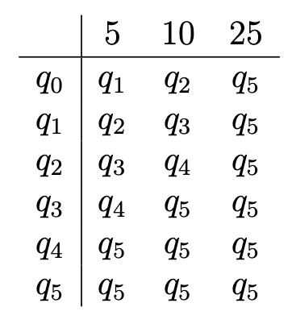
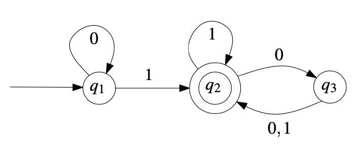
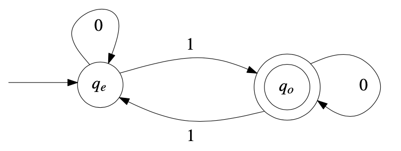
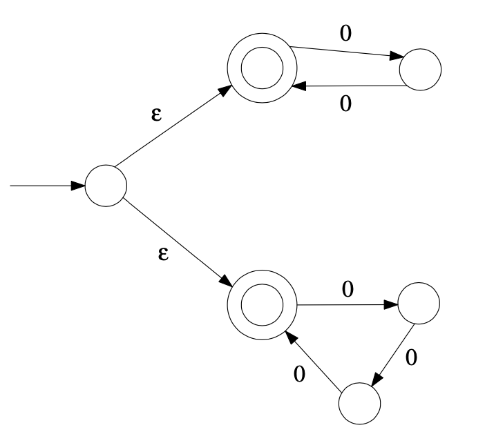
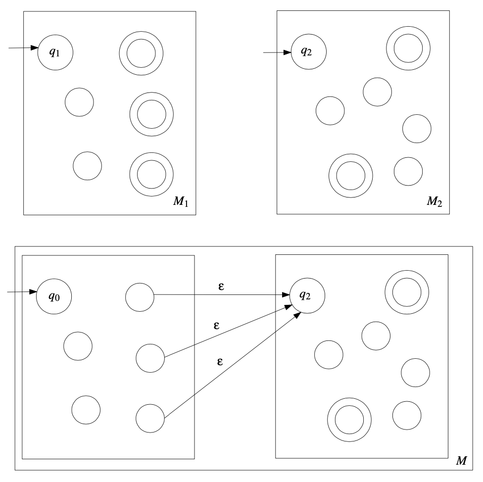
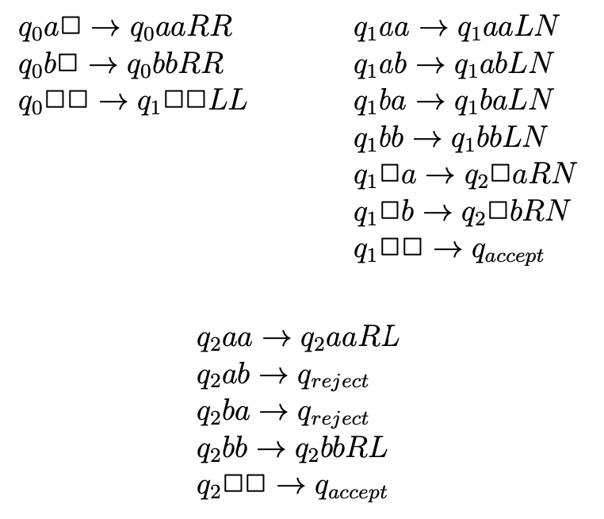
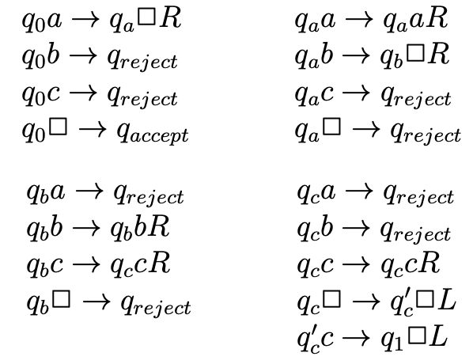
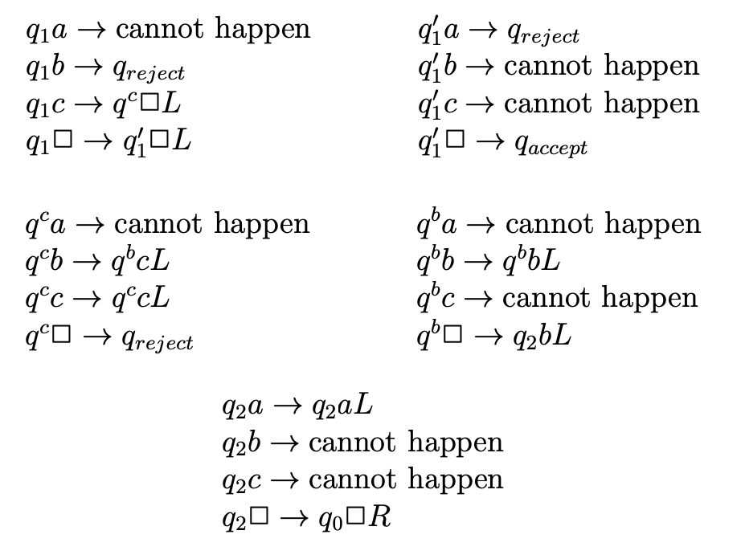

## **1.1**
**Purpose of the Theory of Computation:** Develop formal mathematical models of computation that reflect real-world computers.
#### **Complexity theory**  
  > Central Question in Complexity Theory: Classify problems according to their degree of “difficulty”. Give a rigorous proof that problems that seem to be “hard” are really “hard”.  

* "easy" = efficiently solvable
* "hard" = cannot be solved efficiently or we don't even know if it can be solved  

#### **Computability theory**
> Central Question in Computability Theory: Classify problems as being solvable or unsolvable.
#### **Automata theory**
Definitions and properties of different types of "computational models." *Examples:*
* Finite Automata. These are used in text processing, compilers, and hardware design.
* Context-Free Grammars. These are used to define programming languages and in Artificial Intelligence.
* Turing Machines. These form a simple abstract model of a “real” computer, such as your PC at home.
> Central Question in Automata Theory: Do these models have the same power, or can one model solve more problems than the other?

## **1.2: Mathematical preliminaries**
Check class notes for set stuff
* **Cartesian product:** A × B = {(x, y) : x ∈ A and y ∈ B}
* **Complement:** A = {x : x ̸∈ A}
* A **binary relation** on two sets A and B is a subset of A×B
<mark>don't really get the function notation stuf at the end</mark>

#### Boolean Operations

## **1.3: Proof techniques**
* A **theorem** is a statement that is true
* A **proof** is a sequence of mathematical statements that form an argument to show that a theorem is true
* “Property A if and only if property B”, requires showing two statements:
  * If property A is true, then property B is true (A ⇒ B).
  * If property B is true, then property A is true (B ⇒ A).
* **Direct proof:** approach a theorem directly
* **Constructive proof:** show that a certain object exists by making it (or showing the method of creating it)
  ***Theorem:*** There exists an object with property P.
  ***Proof:***
  Here is the object: [. . .]
  And here is the proof that the object satisfies property P: [. . .]
* **Nonconstructive proof:** we show that a certain object exists, without actually creating it
* **Proof by contradiction:**
  ***Theorem:*** Statement S is true.
  ***Proof:*** Assume that statement S is false. Then, derive a contradiction
  <mark> confused about last two</mark>
#### Pigeon Hole Principle <mark>honestly do not get</mark>
> Pigeon Hole Principle: If n + 1 or more objects are placed into n boxes, then there is at least one box containing two or more objects. In other words, if A and B are two sets such that |A| > |B|, then there is no one-to-one function from A to B.
* **Proof by induction:**
  * ***Basis:*** prove that P(1) is true.
  * ***Induction step:*** Prove that for all n ≥ 1, the following holds: If P(n) is
true, then P (n + 1) is also true.

## **2.1**
#### Toll gate
Costs 25 cents, nickels, dimes, and quarters are accepted. There are 6 possible states for this machine:
* The machine is in state q0, if it has not collected any money yet.
* The machine is in state q1, if it has collected exactly 5 cents.
* The machine is in state q2, if it has collected exactly 10 cents.
* The machine is in state q3, if it has collected exactly 15 cents.
* The machine is in state q4, if it has collected exactly 20 cents.
* The machine is in state q5, if it has collected 25 cents or more.

The machine only needs to keep track of the current state, and since there are 6 states it needs log(6)=3 bits
* Q = {q0, q1, q2, q3, q4, q5}
* Σ = {5, 10, 25}
* q (the start state) is q0
* F = {q5}
* δ is given by the following table:
  

#### Deterministic finite automata

Whether or not the computer is in the accept state at the end of the stream. For example, for this state diagram accepts any string that ends in 0, or one that ends in an even number of zeros after the rightmost 1 (there must be at least one 1).
L(M) = {w : w contains at least one 1 and ends with an even number of 0s}

> #### Finite Automaton
A 5-tuple M = (Q, Σ, δ, q, F )
1. Q is a finite set, whose elements are called states,
2. Σ is a finite set, called the alphabet; the elements of Σ are called symbols,
3. δ : Q × Σ → Q is a function, called the transition function,
  think of as the “program” of the finite automaton M. This function tells us what M can do in “one step”
4. q is an element of Q; it is called the start state,
5. F is a subset of Q; the elements of F are called accept states.

  *Example:* Let r be a state of Q and let a be a symbol of the alphabet Σ. If the finite automaton M is in state r and reads the symbol a, then it switches from state r to state δ(r, a). (In fact, δ(r, a) may be equal to r.)
#### Language of FA
* Let M = (Q, Σ, δ, q, F ) be a finite automaton and let w = w1w2 ...wn be a string over Σ. Define the sequence r0,r1,...,rn of states, in the following way:
  * r0 = q,
  * ri+1 =δ(ri,wi+1),for i=0,1,...,n−1.
  1. If rn ∈ F, then we say that M accepts w.
  2.  If rn ̸∈ F, then we say that M rejects w.
  * *In this definition, w may be an empty string of length 0 (n=0). In this case, the sequence of states has length 1, where r0=q. The empty string is accepted by M if and only if the start state q belongs to F.*
* Let M = (Q,Σ,δ,q,F) be a finite automaton. The language L(M) accepted by M is defined to be the set of all strings that are accepted by M:
  L(M)={w: w is a string over Σ and M accepts w}
* A language A is called **regular**, if there exists a finite automaton M such that A = L(M).
* L(M)={w: w is a string over Σ and δ(q,w)∈F}

#### FA Example
Prove that Language A = {w : w is a binary string containing an odd number of 1s} is regular.
*  The set of states is Q = {qe, qo}. If the finite automaton is in state qe, then it has read an even number of 1s; if it is in state qo, then it has read an odd number of 1s.
* The alphabet is Σ = {0, 1}.
* The start state is qe, because at the start, the number of 1s read by the
automaton is equal to 0, and 0 is even.
* The set F of accept states is F = {qo}.
* The transition function δ is given by the following table:
   | | 0 | 1 |
   | ----------- | ----------- | ----------- |
   | qe | qe | qo |
   | qo | qo | qe |

   

## **2.3: Regular operations**
**Let A and B be two languages over the same alphabet**
1. The **union** of A and B is: A ∪ B = {w : w ∈ A or w ∈ B}
2. The **concatenation** of A and B is: AB = {ww′ : w ∈ A and w′ ∈ B}
  *In words, AB is the set of all strings obtained by taking an arbitrary string w in A and an arbitrary string w′ in B, and gluing them together (such that w is to the left of w′)*
3. The **star** of A is: A* ={u1u2...uk : k≥ 0 and ui  ∈ A for all i = 1,2,...,k}
  _In words, A\* is obtained by taking any finite number of strings in A, and gluing them together. Observe that k = 0 is allowed; this corresponds to the empty string ǫ. Thus, ǫ ∈ A\*_
  * Example: A = {0, 01}, A\* = {ǫ,0,01,00,001,010,0101,000,0001,00101,...}
  * As another example, if Σ = {0, 1}, then Σ∗ is the set of all binary strings (including the empty string). Observe that a string always has a finite length.

## **2.4: Nondeterministic finite automata**
>An NFA accepts a string, if there exists at least one path in the state diagram that
1. starts in the start state,
2. does not hang before the entire string has been read,
3. ends in an accept state
##### _Example_
NFA accepts the language *A = { 0k : k triplebar 0 mod 2 or k triplebar 0 mod 3 }* where 0k is the string consisting of k many 0s. (If k = 0, then 0k = ǫ.)

**a language can be accepted by a DFA if and only if it can be accepted by an NFA**
the ǫ-closure of r, denoted by Cǫ(r), is defined to be the set of all states of N that can be reached from r, by making zero or more ǫ-transitions
<mark>THIS PROOF MAKES NO FUCKEN SENSE TO ME DO WE NEED TO KNOW THIS</mark>

### Converting NFA to DFA
N = (Q,Σ,δ,q,F), converting to M = (Q',Σ,δ',q',F')
* Q' is the powerset of Q. don't forget empty!!
* F' any state of Q' containing F
* q' set of states of N that can be reached with 0 or more ǫ transitions
* δ' same as the normal transition function, but remember that each state you use as rows now comes from Q'

Draw it out, then look and see if there are any states that cannot be reached by the start state and remove until there are no more
## **2.6: Closer under regular operations**
* **The set of regular languages is closed under the union operation**
* **The set of regular languages is closed under the concatenation operation**
  * Let M1 = (Q1, Σ, δ1, q1, F1)
  * Let M2 = (Q2, Σ, δ2, q2, F2)
  * M = M1M2 = (Q,Σ,δ,q0,F)
  1. Q = Q1 ∪ Q2.
  2. q0 = q1.
  3. F = F2.
  
* **The set of regular languages is closed under the star operation**
  * Let N = (Q1,Σ,δ1,q1,F1)
  * NFA M = (Q,Σ,δ,q0,F), such that L(M) = A∗
  * <mark> DO NOT UNDERSTAND THIS PROOF</mark>
* **If A is a regular language over the alphabet Σ, then the complement is also a regular language**
* **If A1 and A2 are regular languages over the same alphabet Σ, then the intersection is also a regular language**

## **2.7: Regular expressions**
_"The class of languages that can be described by regular expressions coincides with the class of regular languages"_

**Consider the expression (0 ∪ 1)01∗**
The language described by this expression is the set of all binary strings
1. that start with either 0 or 1 (this is indicated by (0 ∪ 1)),
2. for which the second symbol is 0 (this is indicated by 0), and
3. that end with zero or more 1s (this is indicated by 1∗)

_More examples:_
* The language {w : w contains exactly two 0s} is described by the expression __1∗01∗01∗__
* The language {w : w contains at least two 0s} is described by the expression __(0 ∪ 1)∗0(0 ∪ 1)∗0(0 ∪ 1)∗__
* The language {w : 1011 is a substring of w} is described by the expression __(0 ∪ 1)∗1011(0 ∪ 1)∗__
* The language {w : the length of w is even} is described by the expression __((0 ∪ 1)(0 ∪ 1))*__
* The language {w : the length of w is odd} is described by the expression __(0 ∪ 1)((0 ∪ 1)(0 ∪ 1))*__
* The language {w : the first and last symbols of w are equal} is described by the expression __0(0∪1)∗0∪1(0∪1)∗1∪0∪1__.<mark>WHAT THA HELL</mark>

**The regular expression 1∗∅ describes the empty language, i.e., the language ∅. (You should convince yourself that this is correct.)**
**The regular expression ∅∗ describes the language {ǫ}**
**every regular language can be described by a regular expression**
> **Theorem 2.7.4** Let R1, R2, and R3 be regular expressions. The following identities hold:
1. R1∅ = ∅R1 = ∅.
2. R1ǫ = ǫR1 = R1.
3. R1 ∪ ∅ = ∅ ∪ R1 = R1.
4. R1 ∪ R1 = R1.
5. R1 ∪ R2 = R2 ∪ R1.
6. R1(R2 ∪ R3) = R1R2 ∪ R1R3.
7. (R1 ∪ R2)R3 = R1R3 ∪ R2R3. 8. R1(R2R3) = (R1R2)R3.
9. ∅∗ =ǫ.
10. ǫ∗ = ǫ.
11. ( ǫ ∪ R 1 ) ∗ = R 1∗ .
12. ( ǫ ∪ R 1 ) ( ǫ ∪ R 1 ) ∗ = R 1∗ .
13. R 1∗ ( ǫ ∪ R 1 ) = ( ǫ ∪ R 1 ) R 1∗ = R 1∗ .
14. R1∗R2 ∪ R2 = R1∗R2.
15. R1(R2R1)∗ = (R1R2)∗R1.
16. (R1 ∪ R2)∗ = (R1∗R2)∗R1∗ = (R2∗R1)∗R2∗.

## **3.1: Context free grammars**
Context free languages are a class of languages that have some kind of recursive structure
The language of a context-free grammar is the set of all strings that:
* can be derived from the start variable
* only contain terminals
> __A context-free grammar is a 4-tuple G = (V,Σ,R,S),__ where
  1. V is a finite set, whose elements are called variables
  2. Σ is a finite set, whose elements are called terminals
  3. V ∩ Σ = ∅
  4. S is an element of V ; it is called the start variable
  5. R is a finite set, whose elements are called rules. Each rule has the form A→w, where A ∈ V and w ∈ (V ∪Σ)∗

## **3.5: Pushdown automata**
the class of languages that can be accepted by these automata is exactly the class of context-free languages
* There is a *tape* which is divided into *cells*. Each cell stores a symbol belonging to a finite set Σ, called the *tape alphabet*. The blank symbol [] is not contained in Σ. If that is in a cell then the cell is empty
* The *tape head* reads the current cell and moves one to the right per move.
* There is a *stack* containing symbols from a finite set Γ, called the *stack alphabet*. This set contains a special symbol $.
* The *stack head* can read the top symbol of the stack. The head can pop the top symbol off the stack and can push symbols of Γ onto the stack.
* There is a *state control* which can be in any one of a finite number of states. The set of states Q contains one special state q, called the start state.
* The input for a pushdown automaton is a string in Σ*. This input string is stored on the tape of the pushdown automaton and, initially, the tape head is on the leftmost symbol of the input string. Initially, the stack only contains the special symbol $, and the pushdown automaton is in the start state q. In one computation step, the pushdown automata does:
  1. Assume it to be in state r. Let a be the symbol of Σ that is read by the tape head, and let A be the symbol of Γ that is on top of the stack
  2. Depending on the current state r, the tape symbol a, and the stack symbol A,
    1. The pushdown automaton switches to a state r′ of Q (which may be equal to r)
    2. the tape head either moves one cell to the right or stays at the current cell, and
    3. the top symbol A is replaced by a string w that belongs to Γ∗. To be more precise,
      i. f w = ǫ, then A is popped from the stack, whereas
      ii. if w = B1B2 ...Bk, with k ≥ 1 and B1,B2,...,Bk ∈ Γ, then A is replaced by w, and Bk becomes the new top symbol of the stack.

## **Chapter 4: Turing machines**
> **Definition**
**A deterministic TM is a 7-tuple, M = (Σ, Γ, Q, δ, q, qaccept, qreject)**
* There are k tapes for some k >= 1. Each tape is divided into cells and is infinite to both the left and right.
* The tape alphabet Γ contains the blank symbol
* Each tape has a tape head that can move one cell per move
* The state control can be in any one of a finite number of states (Q). Q always contains:
  1. start state
  2. accept state
  3. reject state
* The Turing machine performs a sequence of computation steps. In one such step, it does the following:
  1. the TM is in a state r of Q, and each of the k tape heads are on a certain cell
  2. Depending on r and the k symbols,
    * the TM switches to a state r' of Q (could still be r)
    * each tape head writes a symbol of Γ in the cell it is currently scanning (can be the same symbol as before)
    * each head either moves one to the right, left, or stays at the current cell

**Start configuration :** the input is a string over the alphabet Σ. The input string is stored on the first tape, and the head is on the leftmost symbol. All other k-1 tapes are empty and the TM is in the state state q.
**Computation and termination:** the computation terminates when the TM enters the accept state or reject state. If it never enters one of these states, the computation will never terminate.
**Acceptance:** The TM accepts the input string if the computation on this input terminates in the accept state. A string does not belong to L(M) iff:
* the computation of M terminates in the reject state or
* the computation of M does not terminate

___Palindrome example___
**Idea:** The tape head reads the leftmost symbol of w, deletes this symbol and “remembers” it by means of a state. Then the tape head moves to the rightmost symbol and tests whether it is equal to the (already deleted) leftmost symbol.
* If they are equal, then the rightmost symbol is deleted, the tape head moves to the new leftmost symbol, and the whole process is repeated.
* If they are not equal, the Turing machine enters the reject state, and the computation terminates.
* The Turing machine enters the accept state as soon as the string currently stored on the tape is empty.

___Palindrome example with two tapes___
**Idea:** The input string is copied to the second tape. The head of the first tape moves back to the leftmost symbol, while the head of the second stays at the right most. Then both heads move inward at the same rate, comparing symbols at each move.

| STATE | INSTRUCTIONS |
| ----------- | ----------- |
| q0  | the start state, copy w to the second tape |
| q1 | w has been copied; head of first tape moves to the left |
| q2 | head of first tape moves to the right; head of second tape moves to the left; until now, all tests were positive |
| qaccept  | accept state |
| qreject |  reject state |
|Transition function |  |

___Accepting anbncn using tape alphabet {a, b, c, [ ]}___
**Idea:** Repeat the following Stages 1 and 2, until the string is empty.
1. Walk along the string from left to right, delete the leftmost a, delete the leftmost b, and delete the rightmost c.
| STATE | INSTRUCTIONS |
| ----------- | ----------- |
| q0  | the start state; tape head is on the leftmost symbol |
| qa | leftmost a has been deleted; have not read b |
| qb | leftmost b has been deleted; have not read c |
| qc | leftmost c has been deleted; tape head moves to the right |
| q'c | tape head is on rightmost c |
| q1 | rightmost c has been deleted; tape head is on rightmost symbol or [ ] |
| qaccept  | accept state |
| qreject |  reject state |
| Transitions |  |
2. Shift the substring of bs and cs one position to the left; then walk back to the leftmost symbol.
| STATE | INSTRUCTIONS |
| ----------- | ----------- |
| q1  | as above; tape head is on the rightmost symbol or on [ ] |
| qc | copy c one cell to the left |
| qb | copy b one cell to the left |
| q2 | done with shifting; head moves to the left |
| q'1 | If the input string is in the from aibc for some i >= 1, then after state 1 the tape contains the string ai-1[][], the tape head is on the [] immediately to the right of the as, and the TM is in state 11. Then, move one cell to the left; if we read [], then i=1 and we accept; otherwise (we read a) reject |
| Transitions |  |

## **Multi-tape Turning machines**
MTTM are NOT more powerful than single tape ones. Any k-tape Turing machine can be converted to an equivalent one-tape Turing machine.

## **The Church-Turing Thesis**
***The following computation models are equivalent, i.e., any one of them can be converted to any other one:***
1. One-tape Turing machines
2. k-tape Turing machines, for any k ≥ 1.
3. Non-deterministic Turing machines
4. Java programs
5. C++ programs
6. Lisp programs

**Church-Turing Thesis:** Every computational process that is intuitively considered to be an algorithm can be converted to a Turing machine. Basically we define an algorithm to be a Turing machine.

## **One dimensional cellular automata**
